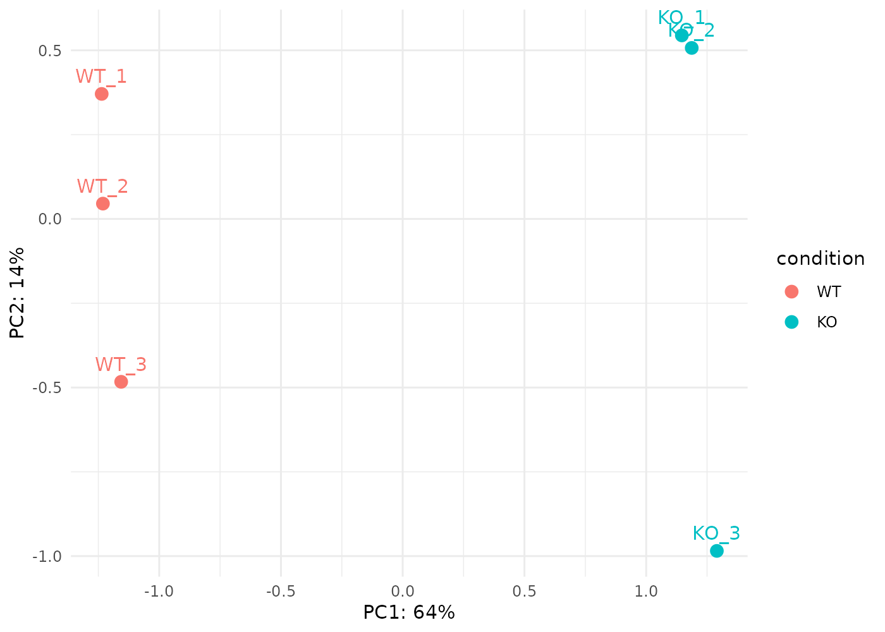
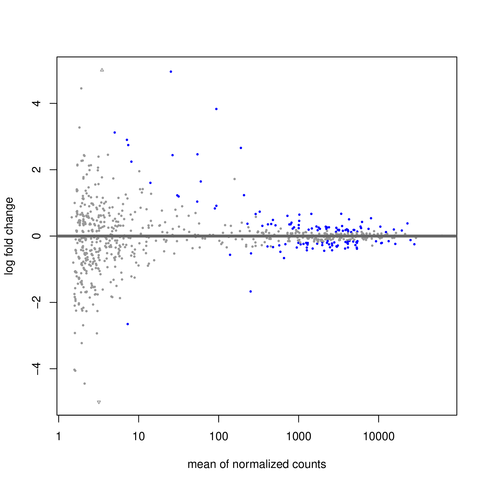
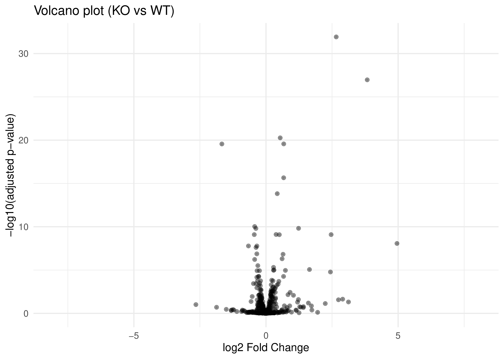

# KAUST TDP43 chr20 RNA-seq Study

This repository contains an RNA-seq analysis pipeline developed as part of the KAUST Bioinformatics Program.  
The project focuses on transcriptomic changes associated with **TDP-43 knockout (KO)** samples with a specific focus on **chromosome 20 (chr20)**.

The workflow covers the full RNA-seq processing pipeline including quality control, read trimming, transcript quantification, differential expression analysis, and downstream visualization.

---

## Project Overview

TDP-43 is an RNA-binding protein implicated in several neurodegenerative diseases.  
This study analyzes RNA-seq data from **TDP-43 knockout (KO)** and **wild-type (WT)** samples to identify gene expression changes associated with the loss of TDP-43.

The analysis emphasizes genes located on **chromosome 20**, enabling targeted investigation of transcriptomic changes within this genomic region.

---

## Dataset

RNA-seq data consist of paired-end sequencing reads from:

- **KO samples:** KO_1, KO_2, KO_3  
- **WT samples:** WT_1, WT_2, WT_3  

Metadata describing the samples can be found in:


Raw sequencing data and reference genomes are not included in this repository due to size limitations but can be reproduced using the provided scripts.

---

## Analysis Workflow

The pipeline consists of the following steps:

1. **Quality Control**
   - FastQC for raw read quality assessment
   - MultiQC for aggregated quality reports

2. **Read Trimming**
   - Adapter removal and quality trimming using **fastp**

3. **Transcript Quantification**
   - Transcript-level quantification using **Salmon**

4. **Differential Expression Analysis**
   - Import quantifications with **tximport**
   - Differential expression analysis using **DESeq2**

5. **Chromosome 20 Filtering**
   - Extract genes located on chr20 for focused analysis

6. **Visualization and Results**
   - PCA plot for sample clustering
   - MA plot for expression changes
   - Volcano plot for differential expression

---

## Repository Structure

```
kaust_tdp43_chr20_rnaseq_study/
│
├── data/
│   └── sample_metadata.csv
│
├── qc_reports/
│   ├── fastqc_raw/
│   ├── fastqc_trimmed/
│   ├── fastp/
│   └── multiqc/
│
├── salmon_quant/
│   ├── KO_1/
│   ├── KO_2/
│   ├── KO_3/
│   ├── WT_1/
│   ├── WT_2/
│   └── WT_3/
│
├── results/
│   ├── tables/
│   ├── figures/
│   └── plots/
│
├── scripts/
│   ├── 00_setup_kaust_20CH.sh
│   ├── 01_qc_fastqc.sh
│   ├── 02_trimming_fastp.sh
│   ├── 03_quant_salmon.sh
│   ├── 05_deseq2.R
│   └── analysis utilities
│
└── README.md
```


---

## Key Results

Differential expression analysis identified several genes significantly affected by TDP-43 knockout.

Main outputs include:

- **DESeq2 differential expression tables**
- **MA plot**
- **Volcano plot**
- **PCA visualization of sample clustering**

Results can be found in:


---

## Tools Used

The analysis pipeline uses the following tools:

- FastQC
- fastp
- MultiQC
- Salmon
- tximport
- DESeq2
- R / Python for downstream analysis

---

## Reproducibility

The scripts in the `scripts/` directory allow the analysis to be reproduced step-by-step starting from raw FASTQ files through differential expression analysis.

Large files such as raw sequencing reads and genome references are excluded from the repository.

---

## Author

Abdullah Misar  
KAUST Bioinformatics Program

## Key Results

### PCA Plot

Principal Component Analysis (PCA) was performed on variance-stabilized counts to visualize sample clustering and overall transcriptomic differences between conditions.



### MA Plot

The MA plot illustrates the relationship between mean gene expression and log2 fold change, highlighting significantly differentially expressed genes.



### Volcano Plot

The volcano plot summarizes differential expression results by combining statistical significance and magnitude of gene expression change.


